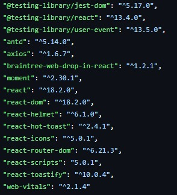
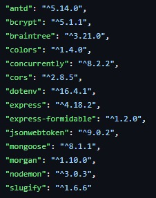

## Intalación de dependencias para el correcto funcionamiento
---
## _Frontend_
Nos adentramos en la carpeta de client.
```sh
cd client
```
Despues ponemos el siguiente comando.
```sh
npm i
```
Lo cual nos instala las dependencias por parte del frontend.
En caso de que nos aparezca un error, estas son las dependencias instaladas por parte del frontend.



Comando para instalar todas las dependencias por parte del frontend.

```bash
npm i "@testing-library/jest-dom@^5.17.0" \
      "@testing-library/react@^13.4.0" \
      "@testing-library/user-event@^13.5.0" \
      "antd@^5.14.0" \
      "axios@^1.6.7" \
      "braintree-web-drop-in-react@^1.2.1" \
      "moment@^2.30.1" \
      "react@^18.2.0" \
      "react-dom@^18.2.0" \
      "react-helmet@^6.1.0" \
      "react-hot-toast@^2.4.1" \
      "react-icons@^5.0.1" \
      "react-router-dom@^6.21.3" \
      "react-scripts@5.0.1" \
      "react-toastify@^10.0.4" \
      "web-vitals@^2.1.4"
```
---
## _Backend_
Nos adentramos en la carpeta "Proyecto_ecommerce".
```sh
cd Proyecto_ecommerce
```
Despues ponemos el siguiente comando.
```sh
npm i
```
Lo cual nos instala las dependencias por parte del backend.
En caso de que nos aparezca un error, estas son las dependencias instaladas por parte del backend.



Comando para instalar todas las dependencias por parte del backend.

```bash
npm i "antd@^5.14.0" \
      "bcrypt@^5.1.1" \
      "braintree@^3.21.0" \
      "colors@^1.4.0" \
      "concurrently@^8.2.2" \
      "cors@^2.8.5" \
      "dotenv@^16.4.1" \
      "express@^4.18.2" \
      "express-formidable@^1.2.0" \
      "jsonwebtoken@^9.0.2" \
      "mongoose@^8.1.1" \
      "morgan@^1.10.0" \
      "nodemon@^3.0.3" \
      "slugify@^1.6.6"
```
---
## _Ejecución del proyecto_
Nos quedamos en la carpeta "Proyecto_ecommerce".
```sh
cd Proyecto_ecommerce
```
Ejecutamos el siguiente comando.
```sh
npm run dev
```

Finalmente observamos el proyecto ejecutarse.
